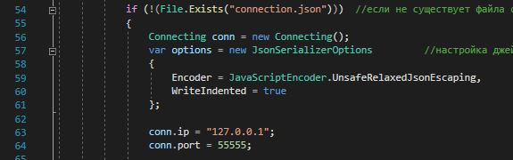

# TCP Чат комната на C#
---

***

Это достаточно простая tcp чат комната с графическим интерфейсом, созданная на C#, использует в основе модуль socket.

Так же реализовано:
   * Локальное сохранение ника и переписки 
   * Возможность изменить имя
   * Настройка соединения
   * Уведомления о сообщениях
   * Добавлена поддержка Python клиента

---
  
||
|:--:| 
| *Главное окно* |
  
  
||
|:--:| 
| *Окно настроек* |
  
  
||
|:--:| 
| *Изменение профиля* |
    
  
||
|:--:| 
| *История сообщений* |
  

***

Хочу отметить, что программа ещё нуждается в доработке, например, могут быть проблемы с отображением при разрешении отличным от 1366 на 768, но в остальном работает вполне не плохо

---

***
# Запуск
Перед запуском основной программы нужно запустить сервер (server.py)

Программная настройка ip и порта производится изменением представленых переменных в файле MainContent.xaml.cs

||
|:--:| 
| *ip и порт* |

---

